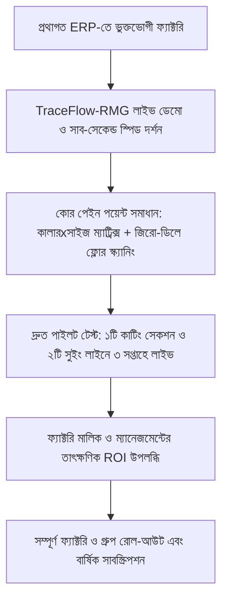

# TraceFlow-RMG: মার্কেট কম্পিটিটিভ অ্যাডভান্টেজ ও মার্কেট ডিসরাপশন ব্লুপ্রিন্ট
## Market Competitive Advantage, Moat Strategy & Competitor Displacement Blueprint

---

## ১. নির্বাহী সারসংক্ষেপ (Executive Summary)
বর্তমান লোকাল মার্কেট (বাংলাদেশ, ভারত, ভিয়েতনাম) এবং গ্লোবাল মার্কেটে তৈরি পোশাক (RMG/Apparel) শিল্পের জন্য অনেক ERP সমাধান প্রচলিত রয়েছে। এর মধ্যে রয়েছে:
- **লোকাল প্রথাগত ERP:** Logic Software, Pridesys, UY Systems, FastReact integration ইত্যাদি।
- **গ্লোবাল এন্টারপ্রাইজ ERP:** SAP S/4HANA (Apparel & Footwear), Oracle NetSuite, Infor CloudSuite Fashion, Microsoft Dynamics 365 ইত্যাদি।

তবে এদের অধিকাংশ সফটওয়্যার **১০-২০ বছর পুরোনো লিগ্যাসি আর্কিটেকচারে বন্দি**। ভারী ইন্সটলেশন, দীর্ঘ ও জটিল ইমপ্লিমেন্টেশন (১-২ বছর), আকাশচুম্বী লাইসেন্স ও কনসাল্টিং ফি, ক্লাউড-নেটিভ ফিচারের অভাব, ধীরগতির UI এবং রিয়েল-টাইম ফ্লোর বারকোড স্ক্যানিংয়ে চরম ব্যর্থতা তাদের প্রধান দুর্বলতা।

**TraceFlow-RMG** এমনভাবে ডিজাইন ও ডেভেলপ করা হয়েছে যাতে এটি প্রযুক্তিগত উৎকর্ষ, ইউজার এক্সপেরিয়েন্স এবং তৈরি পোশাকের বাস্তব মাঠপর্যায়ের চ্যালেঞ্জের সমাধানে প্রতিদ্বন্দ্বীদের চেয়ে বহু গুণ এগিয়ে থাকে।

---

## ২. প্রতিদ্বন্দ্বীদের দুর্বলতা এবং TraceFlow-RMG এর গেম-চেঞ্জিং সমাধান (The Strategic Moat)

| ক্ষেত্র / চ্যালেঞ্জ | বিদ্যমান লোকাল ERP (Logic, Pridesys, etc.) | বিদ্যমান গ্লোবাল ERP (SAP, Oracle, Infor) | TraceFlow-RMG এর আনফেয়ার অ্যাডভান্টেজ (Unfair Advantage) |
| :--- | :--- | :--- | :--- |
| **১. আর্কিটেকচার ও টেকনোলজি** | পুরোনো মোনোলিথিক (.NET WebForms, PHP 5/7, জাভা ডেক্সটপ)। পেজ রিলোড ছাড়া কাজ করে না। | ভারী ও জটিল। বেশিরভাগ ক্ষেত্রে প্রাইভেট ভিপিএন বা স্যাটেলাইট ক্লায়েন্ট দরকার হয়। | **আধুনিক লিন টেক-স্ট্যাক:** Laravel 13, PostgreSQL 16, Redis 7, React 19, এবং হাইপার-ফাস্ট Vite। জিরো পেজ রিলোড, সাব-সেকেন্ড রেসপন্স টাইম। |
| **২. প্রোডাকশন ফ্লোর স্ক্যানিং স্পিড** | স্ক্যান করার পর ১-৩ সেকেন্ড হ্যাং করে। শিফট পরিবর্তনের সময় ট্রাফিকের চাপে ডাটাবেস ক্র্যাশ বা ডেডলক হয়। | বারকোড স্ক্যানিংয়ের জন্য আলাদা থার্ড-পার্টি মিডলওয়্যার বা ভারী লাইসেন্স লাগে। | **< ৫০ মিলিসেকেন্ড রেসপন্স:** ইন-মেমোরি Redis ডিস্ট্রিবিউটেড লক ও অপটিমিস্টিক/পেসিমিস্টিক কনকারেন্সি কন্ট্রোল। ১০০০+ কাটিং ও সুইং লাইন একসাথে স্ক্যান করলেও জিরো ডেডলক। |
| **৩. ইমপ্লিমেন্টেশন সময় ও খরচ** | ৬ মাস থেকে ১৮ মাস লেগে যায়। কোটি কোটি টাকা বাস্তবায়ন ব্যয়। | ১ থেকে ২ বছর। মিলিয়ন ডলার কনসাল্টিং ফি। মাঝারি কারখানার নাগালের বাইরে। | **দ্রুত রোল-আউট (৩ থেকে ৬ সপ্তাহ):** প্রি-বিল্ট RMG ওয়ার্কফ্লো, রেডি-টু-গো টেন্যান্ট সিডার এবং স্বয়ংক্রিয় পারমিশন ডিসকভারি ইঞ্জিন। |
| **৪. ইউজার ইন্টারফেস ও ডেটা এন্ট্রি (UX)** | জটিল, কুৎসিত টেবিল ও শতাধিক ইনপুট ফিল্ড। অপারেটরদের প্রচুর টাইপ করতে হয়, ডাটা এন্ট্রিতে ভুল হয়। | কর্পোরেট ও ড্রাই UI। গার্মেন্টস ফ্লোর বা মার্চেন্ডাইজারদের জন্য ফ্রেন্ডলি নয়। | **হাই-ডেনসিটি এন্টারপ্রাইজ UX:** TanStack v8 ভার্চুয়ালাইজড গ্রিড, ৬৪০ পিক্সেল স্লাইড-ওভার ড্রয়ার, কালার x সাইজ ম্যাট্রিক্স ড্রপডাউন এবং শর্টকাট-চালিত কীবোর্ড ন্যাভিগেশন। |
| **৫. বাটন ও অ্যাকশন লেভেল পারমিশন** | শুধুমাত্র পেজ বা মেনু লেভেলে সীমাবদ্ধ। নির্দিষ্ট বাটন (যেমন 'Approve Costing', 'Reprint Barcode') সহজে নিয়ন্ত্রণ করা যায় না। | পারমিশন স্ট্রাকচার এতো জটিল যে কনসাল্ট্যান্ট ছাড়া নতুন পারমিশন কনফিগার করা অসম্ভব। | **ডিক্লেয়ারেটিভ পারমিশন ইঞ্জিন:** প্রতিটি ডোমেনের `manifest.php` থেকে স্বয়ংক্রিয় পারমিশন ডিসকভারি। অ্যাডমিন যেকোনো ইউজারের নির্দিষ্ট বাটন হাইড/শো এক ক্লিকে ওভাররাইড করতে পারেন। |
| **৬. মাল্টি-কোম্পানি ও গ্রুপ রিপোর্টিং** | সিস্টার কনসার্নদের জন্য আলাদা ডাটাবেজ করতে হয়। সেন্ট্রাল গ্রুপ ব্যালেন্স বা অর্ডার স্ট্যাটাস বের করা অসম্ভব। | সম্ভব হলেও আলাদা আলাদা ইনস্ট্যান্স কনফিগারেশনের জটিলতা অনেক বেশি। | **ন্যাটিভ মাল্টি-কোম্পানি আইসোলেশন (ADR-08):** একক ডাটাবেজে সম্পূর্ণ সিকিউরড কোম্পানি ও ইউনিট আইসোলেশন, অথচ গ্রুপ ম্যানেজমেন্ট এক ক্লিকে কনসোলিডেটেড রিপোর্ট দেখতে পারে। |
| **৭. স্মার্ট ডকুমেন্ট ও কোড নাম্বারিং** | হার্ডকোডেড অথবা ম্যানুয়াল টাইপ করতে হয়। মানুষ ভুল করে ডুপ্লিকেট অর্ডার বা বান্ডিল নম্বর দেয়। | কনফিগারেশন খুব রিজিড। লোকাল বায়িং হাউজ বা ফ্যাক্টরির ফরম্যাট সাপোর্ট করা কঠিন। | **স্মার্ট সিকোয়েন্স ইঞ্জিন (ADR-09):** জিরো-কনফিগ ফলব্যাক সহ সম্পূর্ণ কাস্টমাইজেবল। UI-তে কোড রিড-অনলি এবং স্বয়ংক্রিয় জেনারেটেড। |

---

## ৩. যে ৫টি শীর্ষ বৈশিষ্ট্যে TraceFlow-RMG প্রতিদ্বন্দ্বীদের পরাজিত করবে (Top 5 Pillars to Beat Competitors)

### পিলার ১: কালার x সাইজ ব্রেক-ডাউন ম্যাট্রিক্সের যুগান্তকারী অভিজ্ঞতা (PO Matrix Grid)
- **বিদ্যমান সমস্যা:** একটি অর্ডারে ২০টি রঙ এবং ১০টি সাইজ থাকলে প্রচলিত সফটওয়্যারে ২০০ বার রো অ্যাড করতে হয়, যা মার্চেন্ডাইজারের ঘণ্টার পর ঘণ্টা নষ্ট করে।
- **TraceFlow সমাধান:** এক্সেল-লাইক ফ্লুইড ইন-লাইন ম্যাট্রিক্স ড্রয়ার। অনুভূমিকভাবে সাইজ এবং উল্লম্বভাবে রঙ থাকবে। মার্চেন্ডাইজার এক্সেলে যেভাবে কোয়ান্টিটি টাইপ বা পেস্ট করে, ঠিক একইভাবে দ্রুত এন্ট্রি দিতে পারবেন। সাথে সাথে রিয়েল-টাইমে মোট অর্ডার ও ব্যালেন্স ক্যালকুলেট হবে।

### পিলার ২: রিয়েল-টাইম ফ্লোর ট্র্যাকিং ও কিউসি (Floor Line Tracking with Zero Glitch)
- **বিদ্যমান সমস্যা:** কাটিং থেকে বান্ডিল তৈরি, প্রিন্টিং/এমব্রয়ডারি গেট-পাস, লাইন লোডিং এবং ফিনিশিং পর্যন্ত প্রতি পদক্ষেপে ম্যানুয়াল খাতা বা ধীরগতির স্ক্যানার ব্যবহার করা হয়।
- **TraceFlow সমাধান:** 
  - মোবাইল ও ট্যাবলেট ফ্রেন্ডলি ফ্লোর ইন্টারফেস।
  - অফলাইন-রেডি ক্যাশিং ও ব্যাচ স্ক্যানিং টেকনোলজি (ইন্টারনেট সাময়িক ড্রপ করলেও স্ক্যান মিস হবে না)।
  - ট্র্যাফিক জ্যাম প্রতিরোধে মিলি-সেকেন্ড লেভেলের কনকারেন্সি সুরক্ষা।

### পিলার ৩: লাইভ কস্টিং ও কনজাম্পশন অপ্টিমাইজেশন (Pre-Costing vs Actual Costing Drift Engine)
- **বিদ্যমান সমস্যা:** অধিকাংশ কারখানায় প্রি-কস্টিংয়ের পর প্রোডাকশন চলাকালীন ফেব্রিক অপচয় বা সুতা/এক্সেসরিজের অতিরিক্ত খরচ ট্র্যাকিং করা যায় না। শিপমেন্ট শেষে তারা জানতে পারে যে লস হয়েছে।
- **TraceFlow সমাধান:** 
  - লাইভ ড্র্রিফ্ট ইঞ্জিনের মাধ্যমে প্রি-কস্টিং বনাম পোস্ট-কস্টিংয়ের পার্থক্য তাৎক্ষণিক দেখানো হয়।
  - যদি কোনো অর্ডারে মার্কার এফিশিয়েন্সি কমে যায় বা ২% এর বেশি ফেব্রিক অপচয় হয়, সিস্টেম তাৎক্ষণিক প্রডাকশন ম্যানেজার ও ম্যানেজমেন্টকে অ্যালার্ট পাঠায়।

### পিলার ৪: ওপেন ও আধুনিক ইন্টিগ্রেশন ইকোসিস্টেম (API-First Open Platform)
- **বিদ্যমান সমস্যা:** লোকাল ERP-গুলো বন্ধ ইকোসিস্টেম। তারা CAD সফটওয়্যার (Gerber, Lectra), অটো-কাটার মেশিন বা বায়ার পোর্টালের সাথে সহজে ডাটা আদান-প্রদান করতে পারে না।
- **TraceFlow সমাধান:** 
  - ১০০% সিকিউরড RESTful API এবং ওয়েবহুক আর্কিটেকচার।
  - আধুনিক বায়িং হাউজ, মার্চেন্ডাইজিং টুলস ও অটোমেটেড কাটিং টেবিলের সাথে প্লাগ-অ্যান্ড-প্লে ইন্টিগ্রেশন।

### পিলার ৫: সম্পূর্ণ ক্লিন ও লাইটওয়েট অপারেশনাল ফুটপ্রিন্ট (Cloud-Native & Low Hardware Cost)
- **বিদ্যমান সমস্যা:** SAP বা প্রথাগত সফটওয়্যার চালাতে ফ্যাক্টরিতে লাখ লাখ টাকার ভারী সার্ভার, উইন্ডোজ সার্ভার লাইসেন্স ও ডেডিকেটেড আইটি টিম লাগে।
- **TraceFlow সমাধান:** 
  - ডকার কন্টেইনারাইজড লাইটওয়েট আর্কিটেকচার।
  - খুব সাধারণ ক্লাউড সার্ভার (AWS, DigitalOcean, Hetzner) অথবা কারখানার একটি সাধারণ অন-প্রিমিস লিনাক্স সার্ভারেই শত শত ব্যবহারকারী অত্যন্ত দ্রুতগতিতে কাজ করতে পারেন। কারখানার আইটি ইনফ্রাস্ট্রাকচার খরচ ৮০% কমে যাবে।

---

## ৪. সেলস ও মার্কেট অ্যাডপশন স্ট্র্যাটেজি (How We Win Customers in the Market)

1. **ফ্রি পাইলট ট্রায়াল (Trojan Horse Strategy):**
   - ক্লায়েন্টকে সম্পূর্ণ কারখানা একবারে বদলাতে না বলে কেবল "কাটিং ও সুইং ট্র্যাকিং" অথবা "মার্চেন্ডাইজিং কস্টিং" মডিউলে পাইলট রান করানো।
   - ৩ সপ্তাহের মধ্যে আমাদের সিস্টেমের গতি ও নির্ভুলতা দেখে ফ্যাক্টরি কর্তৃপক্ষ নিজেরাই অন্য সব মডিউল চালু করার সিদ্ধান্ত নেবে।
2. **জিরো ডেটা লস ও সহজ মাইগ্রেশন:**
   - বিদ্যমান লিগ্যাসি সফটওয়্যার (এক্সেল বা পুরাতন ERP) থেকে এক ক্লিকে বায়িং, বায়ার, স্টাইল এবং হিস্টোরিক্যাল ডাটা ইমপোর্ট করার জন্য বিল্ট-ইন মাইগ্রেশন উইজার্ড।
3. **লোকাল সাপোর্টেড গ্লোবাল কোয়ালিটি:**
   - ইন্টারফেস আন্তর্জাতিক মানের (English UI), কিন্তু ডকুমেন্টেশন, ট্রেনিং ও সাপোর্ট হবে স্থানীয় ভাষায় (বাংলা), যাতে ফ্লোর ইনচার্জ থেকে জেনারেল ম্যানেজার পর্যন্ত সবাই স্বাচ্ছন্দ্যে ব্যবহার করতে পারেন।

---

## ৫. উপসংহার ও ভবিষ্যত নিশ্চয়তা
TraceFlow-RMG এমন একটি এন্টারপ্রাইজ প্ল্যাটফর্ম যা শুধু আজকের প্রয়োজন মেটাবে না, বরং আগামী ১০-১৫ বছর পর্যন্ত যে কোনো পরিবর্তন ও প্রযুক্তিগত স্কেলিংয়ের সাথে টিকে থাকবে। আমাদের আর্কিটেকচারাল ইনভেরিয়েন্টসমূহ (UUID v7, Modular DDD, Dynamic Lookups, Zero-Error Protocol) সিস্টেমের স্থিতিশীলতা ও বিশ্বস্ততা নিশ্চিত করে, যা বাজারে অন্য যেকোনো প্রতিদ্বন্দীর চেয়ে TraceFlow-RMG-কে শ্রেষ্ঠ অবস্থানে রাখবে।
