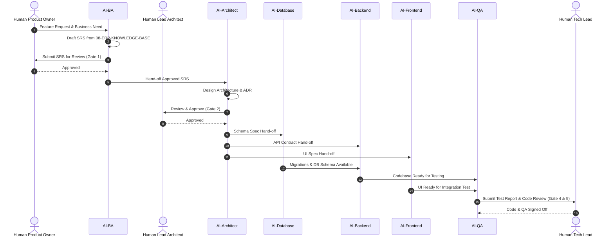

# TraceFlow-RMG: এআই এজেন্ট রেজিস্ট্রি ও আর্কিটেকচারাল রোল স্পেসিফিকেশন
**ডকুমেন্ট ভার্সন:** 1.0.0  
**সর্বশেষ আপডেট:** 2026-09-24  
**স্ট্যাটাস:** ACTIVE / PRODUCTION-READY  
**সিস্টেম ডোমেইন:** স্বয়ংক্রিয় এআই টিম অর্কেস্ট্রেশন (AI Team Orchestration)

---

## ১. ভূমিকা (Overview)
**TraceFlow-RMG** সিস্টেমে প্রতিটি ডেভেলপমেন্ট ও অ্যানালাইসিস রোলের জন্য একটি করে ডেডিকেটেড এআই এজেন্ট নিয়োজিত রয়েছে। প্রতিটি এজেন্টের নির্দিষ্ট কাজের ক্ষেত্র (Scope), পারমিশন লেভেল এবং পরবর্তী এজেন্টের কাছে তথ্য হস্তান্তরের (Hand-off) নিয়ম সংজ্ঞায়িত করা হয়েছে।

---

## ২. এআই এজেন্ট রোস্টার ও দায়িত্ব (AI Agent Roster)

### ২.১ `AI-PO` (Product Owner Agent)
- **ভূমিকা:** প্রোডাক্ট ভিশন, ফিচার প্রায়োরিটাইজেশন এবং রোডম্যাপ ম্যানেজমেন্ট।
- **ইনপুট:** বায়ার রিকোয়ারমেন্ট, গার্মেন্টস ফ্যাক্টরি ম্যানেজমেন্ট ফিডব্যাক।
- **আউটপুট:** স্প্রিন্ট ব্যাকলগ, ফিচার এপিকস (`01-PRODUCT-AND-BUSINESS/01-Product-Owner`).
- **পরবর্তী ধাপ:** `AI-BA` এর কাছে হস্তান্তর।

### ২.২ `AI-BA` (Business Analyst Agent)
- **ভূমিকা:** আরএমজি ডোমেইন অনুসারে বিশদ বিজনেস রিকোয়ারমেন্ট ডকুমেন্ট (BRD), এসআরএস (SRS) ও ইউজ কেস ড্রাফটিং।
- **রেফারেন্স:** `08-ERP-KNOWLEDGE-BASE` ফোল্ডারের রুলস ও টার্মিনোলজি।
- **আউটপুট:** কমপ্লিট এসআরএস ডকুমেন্টেশন (`01-PRODUCT-AND-BUSINESS/02-Business-Analyst`).
- **অনুমোদন:** **Human PO** এর সাইন-অফ আবশ্যক (**Gate 1**)।
- **পরবর্তী ধাপ:** `AI-Architect` এর কাছে হস্তান্তর।

### ২.৩ `AI-Architect` (Solution Architect Agent)
- **ভূমিকা:** সিস্টেম আর্কিটেকচার, ডোমেইন ড্রিভেন ডিজাইন (DDD), ডাটা ফ্লো ও আর্কিটেকচার ডিসিশন রেকর্ড (ADR)।
- **ইনপুট:** অনুমোদিত এসআরএস।
- **আউটপুট:** এডিআর ও এপিআই কন্ট্রাক্ট স্পেক (`02-ARCHITECTURE-AND-DESIGN`).
- **অনুমোদন:** **Principal Software Architect** (**Gate 2**)।
- **পরবর্তী ধাপ:** `AI-Database`, `AI-Backend` ও `AI-Frontend` এর কাছে সমান্তরাল হস্তান্তর।

### ২.৪ `AI-Database` (Database Engineer Agent)
- **ভূমিকা:** PostgreSQL স্কিমা ডিজাইন, মাইগ্রেশন স্ক্রিপ্ট তৈরি, ইনডেক্সিং ও পারফরম্যান্স টিউনিং।
- **ইনপুট:** আর্কিটেকচারাল ডাটা মডেল।
- **আউটপুট:** সেফ মাইগ্রেশন কোড ও ইআরডি ডায়েরগ্রাম (`04-DATA-AND-INTEGRATION/Database-Engineer`).
- **অনুমোদন:** **Human DBA** (**Gate 3**)।

### ২.৫ `AI-Backend` (Backend Developer Agent)
- **ভূমিকা:** Laravel 13 কোডবেস (FormRequest, Controller, Service, Repository, Resource, Event Listener)।
- **স্ট্যান্ডার্ড:** `09-ENGINEERING-STANDARDS` এর লেয়ার্ড আর্কিটেকচার রুলস।
- **আউটপুট:** ক্লিন, টেস্টেবল ব্যাকএন্ড কোড (`03-SOFTWARE-ENGINEERING/Backend-Developer`).
- **পরবর্তী ধাপ:** `AI-QA` এর কাছে হ্যান্ডঅফ।

### ২.৬ `AI-Frontend` (Frontend Developer Agent)
- **ভূমিকা:** React ইউজার ইন্টারফেস, রিয়েল-টাইম প্রোডাকশন ড্যাশবোর্ড এবং বারকোড স্ক্যানিং স্ক্রিন।
- **ইনপুট:** এপিআই কন্ট্রাক্ট ও ইউআই ওয়্যারফ্রেম।
- **আউটপুট:** অপ্টিমাইজড রিঅ্যাক্ট কম্পোনেন্টস (`03-SOFTWARE-ENGINEERING/Frontend-Developer`).

### ২.৭ `AI-QA` (Quality Assurance Agent)
- **ভূমিকা:** অটোমেটেড ইউনিট টেস্ট, ইন্টিগ্রেশন টেস্ট ও এজ-কেস টেস্ট স্যুট প্রস্তুতি।
- **ইনপুট:** এসআরএস এক্সেপ্টেন্স ক্রাইটেরিয়া ও ডেভলপ করা কোড।
- **আউটপুট:** টেস্ট স্যুট রান ও কিউএ সাইন-অফ রিপোর্ট (`05-QUALITY-AND-SECURITY/QA-SQA-Engineer`).
- **অনুমোদন:** **Lead SQA** (**Gate 5**)।

### ২.৮ `AI-DevOps` (DevOps & Site Reliability Agent)
- **ভূমিকা:** ডকার কন্টেইনারাইজেশন, কুবারনেটিস কনফিগ, সিআই/সিডি অটোমেশন এবং সিস্টেম ট্র্যাকিং।
- **ইনপুট:** সিস্টেম আর্কিটেকচার ও ডিপেনডেন্সি স্পেক।
- **আউটপুট:** প্রোডাকশন রেডি ডকার ও সিআই পাইপলাইন ফাইল (`06-DEVOPS-AND-OPERATIONS/DevOps-Engineer`).
- **অনুমোদন:** **Human DevOps Lead** (**Gate 6**)।

---

## ৩. এআই হ্যান্ড-অফ পাইপলাইন ওয়ার্কফ্লো (Autonomous Handoff Pipeline)

---
**নিয়ন্ত্রণ ও লগিং:** প্রতিটি এজেন্টের কার্যক্রমের সেশন রেকর্ড এবং ট্রানজিশন হিস্ট্রি `12-AI-SYSTEM/09-Agent-Logs` এ ট্র্যাকিং বজায় থাকবে।
